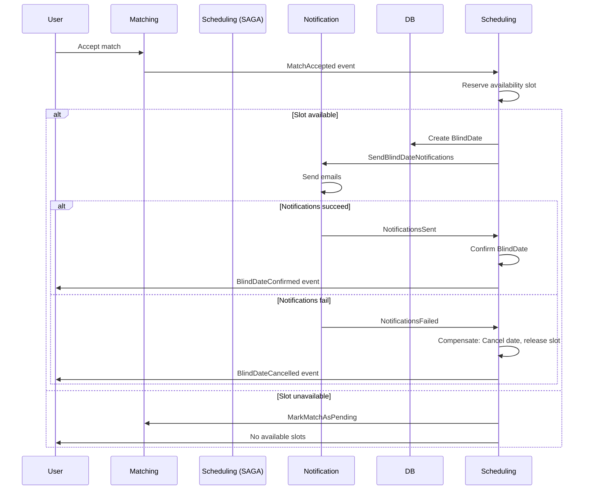

# SAGA Processes - Distributed Transactions

> **Ensuring atomicity across microservices**
>
> This document defines all SAGA workflows in QuietMatch. SAGAs manage multi-step distributed transactions with compensating actions for rollback.

---

## Table of Contents

- [What is a SAGA?](#what-is-a-saga)
- [Orchestration vs Choreography](#orchestration-vs-choreography)
- [Technology: MassTransit SAGA](#technology-masstransit-saga)
- [SAGA 1: Blind Date Creation](#saga-1-blind-date-creation)
- [SAGA 2: User Deletion](#saga-2-user-deletion)
- [SAGA 3: Subscription Activation](#saga-3-subscription-activation)
- [SAGA State Storage](#saga-state-storage)
- [Error Handling & Timeouts](#error-handling--timeouts)
- [Testing SAGAs](#testing-sagas)

---

## What is a SAGA?

**Problem**: In microservices, a business transaction often spans multiple services. Traditional ACID transactions don't work across service boundaries.

**Solution**: SAGA pattern breaks the transaction into **steps**, with each step having a **compensating transaction** to undo it if later steps fail.

**Example**: "Accept match → Reserve availability slot → Send notifications → Confirm date"
- If "Send notifications" fails → Undo: Release slot, revert match status

---

## Orchestration vs Choreography

QuietMatch uses **Orchestration** (centralized coordinator).

| Orchestration | Choreography |
|---------------|--------------|
| **Centralized** state machine | **Decentralized** (services react to events) |
| Easier to understand & debug | More complex, harder to trace |
| Single point of control | No single point of failure |
| **QuietMatch uses this** | Better for advanced scenarios |

**Why Orchestration?** Learning clarity, easier debugging, single source of truth for SAGA state.

---

## Technology: MassTransit SAGA

**Library**: [MassTransit](https://masstransit-project.com/) (supports RabbitMQ and Azure Service Bus)

**Alternatives Considered**:
- **NServiceBus**: Excellent SAGA support, but commercial license ($$$)
- **Custom**: Full control, but error-prone and time-consuming

**Decision**: MassTransit (open-source, industry-standard, great SAGA support)

---

## SAGA 1: Blind Date Creation

**Trigger**: User accepts a Match

**Goal**: Create BlindDate with availability reservation and notifications

**Orchestrator**: SchedulingService

### Steps

```
1. MatchAccepted event received
2. Reserve availability slot (both members)
   ↳ If fails: Compensate → Mark match as Pending (retry later)
3. Create BlindDate entity
   ↳ If fails: Compensate → Release slot
4. Send notifications (both members)
   ↳ If fails: Compensate → Cancel date, release slot
5. Confirm BlindDate
   ↳ Success: SAGA completes
```

### State Machine

```csharp
public class BlindDateSagaState : SagaStateMachineInstance
{
    public Guid CorrelationId { get; set; }
    public string CurrentState { get; set; }

    public MatchId MatchId { get; set; }
    public MemberId InitiatorId { get; set; }
    public MemberId PartnerId { get; set; }
    public AvailabilitySlotId? ReservedSlotId { get; set; }
    public BlindDateId? BlindDateId { get; set; }
}

public class BlindDateSaga : MassTransitStateMachine<BlindDateSagaState>
{
    public BlindDateSaga()
    {
        InstanceState(x => x.CurrentState);

        Event(() => MatchAccepted);
        Event(() => SlotReserved);
        Event(() => SlotReservationFailed);
        Event(() => NotificationsSent);
        Event(() => NotificationsFailed);

        Initially(
            When(MatchAccepted)
                .Then(context => {
                    context.Instance.MatchId = context.Data.MatchId;
                    context.Instance.InitiatorId = context.Data.InitiatorId;
                    context.Instance.PartnerId = context.Data.PartnerId;
                })
                .PublishAsync(context => context.Init<ReserveAvailabilitySlot>(new {
                    context.Instance.InitiatorId,
                    context.Instance.PartnerId
                }))
                .TransitionTo(AwaitingSlotReservation));

        During(AwaitingSlotReservation,
            When(SlotReserved)
                .Then(context => context.Instance.ReservedSlotId = context.Data.SlotId)
                .PublishAsync(context => context.Init<SendBlindDateNotifications>(new {
                    context.Instance.InitiatorId,
                    context.Instance.PartnerId,
                    context.Instance.ReservedSlotId
                }))
                .TransitionTo(AwaitingNotifications),

            When(SlotReservationFailed)
                .Then(context => Log.Warning("Slot reservation failed: {Reason}", context.Data.Reason))
                .PublishAsync(context => context.Init<MarkMatchAsPending>(new {
                    context.Instance.MatchId,
                    Reason = "No available slots found"
                }))
                .Finalize());

        During(AwaitingNotifications,
            When(NotificationsSent)
                .Then(context => context.Instance.BlindDateId = context.Data.BlindDateId)
                .PublishAsync(context => context.Init<BlindDateConfirmed>(new {
                    context.Instance.BlindDateId,
                    context.Instance.MatchId
                }))
                .Finalize(),

            When(NotificationsFailed)
                .Then(context => Log.Error("Notifications failed, compensating"))
                // Compensating transaction: Release slot, cancel date
                .PublishAsync(context => context.Init<ReleaseAvailabilitySlot>(new {
                    context.Instance.ReservedSlotId
                }))
                .PublishAsync(context => context.Init<CancelBlindDate>(new {
                    context.Instance.BlindDateId,
                    Reason = "Notification failure"
                }))
                .Finalize());

        SetCompletedWhenFinalized();
    }

    public State AwaitingSlotReservation { get; private set; }
    public State AwaitingNotifications { get; private set; }

    public Event<MatchAccepted> MatchAccepted { get; private set; }
    public Event<SlotReserved> SlotReserved { get; private set; }
    public Event<SlotReservationFailed> SlotReservationFailed { get; private set; }
    public Event<NotificationsSent> NotificationsSent { get; private set; }
    public Event<NotificationsFailed> NotificationsFailed { get; private set; }
}
```

### Sequence Diagram



---

## SAGA 2: User Deletion

**Trigger**: User clicks "Delete Account" (GDPR Right to Erasure)

**Goal**: Delete user data across all services

**Orchestrator**: PrivacyService

### Steps

```
1. DataDeletionRequested event
2. Soft-delete Profile → Mark as deleted, encrypt PII
   ↳ If fails: Retry (idempotent)
3. Delete Matches → Anonymize or delete
   ↳ If fails: Retry
4. Delete Blind Dates → Cancel upcoming, anonymize past
   ↳ If fails: Retry
5. Revoke Subscriptions → Cancel payment
   ↳ If fails: Retry (non-critical, manual cleanup)
6. Delete Notifications → Purge notification log
   ↳ If fails: Retry
7. Schedule Hard Delete → After 30 days retention
   ↳ Success: SAGA completes
```

**Note**: No compensating transactions (deletion is irreversible). Use retries with idempotency.

### State Machine (Simplified)

```csharp
public class UserDeletionSaga : MassTransitStateMachine<UserDeletionSagaState>
{
    public UserDeletionSaga()
    {
        Initially(
            When(DataDeletionRequested)
                .PublishAsync<SoftDeleteProfile>()
                .TransitionTo(DeletingProfile));

        During(DeletingProfile,
            When(ProfileDeleted)
                .PublishAsync<DeleteMatches>()
                .TransitionTo(DeletingMatches));

        During(DeletingMatches,
            When(MatchesDeleted)
                .PublishAsync<DeleteBlindDates>()
                .TransitionTo(DeletingDates));

        During(DeletingDates,
            When(DatesDeleted)
                .PublishAsync<RevokeSubscriptions>()
                .TransitionTo(RevokingSubscriptions));

        During(RevokingSubscriptions,
            When(SubscriptionsRevoked)
                .PublishAsync<ScheduleHardDelete>( /* after 30 days */)
                .Finalize());
    }
}
```

---

## SAGA 3: Subscription Activation

**Trigger**: User selects Premium plan, pays via Stripe

**Goal**: Activate subscription features

**Orchestrator**: PaymentService

### Steps

```
1. StripePaymentSucceeded webhook
2. Create Subscription entity
   ↳ If fails: Retry, refund if critical
3. Activate premium features in Profile
   ↳ If fails: Compensate → Cancel subscription, refund
4. Send welcome email
   ↳ If fails: Log, don't block (non-critical)
5. Publish SubscriptionActivated event
   ↳ Success: SAGA completes
```

---

## SAGA State Storage

**Where**: SAGA state stored in orchestrating service's database

**Table**: `saga_state` (created by MassTransit)

```sql
CREATE TABLE saga_state (
    correlation_id UUID PRIMARY KEY,
    current_state VARCHAR(50),
    saga_data JSONB,  -- Serialized SAGA state
    created_at TIMESTAMP,
    updated_at TIMESTAMP
);
```

**Example Row**:
```json
{
  "correlationId": "123e4567-e89b-12d3-a456-426614174000",
  "currentState": "AwaitingNotifications",
  "sagaData": {
    "matchId": "...",
    "initiatorId": "...",
    "partnerId": "...",
    "reservedSlotId": "..."
  }
}
```

---

## Error Handling & Timeouts

### Retry Strategy
- **Immediate retry**: 3 attempts with exponential backoff (1s, 2s, 4s)
- **Delayed retry**: Move to delayed queue (retry after 5 min)
- **Dead Letter Queue**: After all retries fail, move to DLQ for manual review

### Timeouts
```csharp
During(AwaitingSlotReservation,
    When(SlotReservationTimeout) // If no response in 30 seconds
        .Then(context => Log.Warning("Slot reservation timeout"))
        .PublishAsync<MarkMatchAsPending>()
        .Finalize());
```

### Idempotency
All SAGA commands MUST be idempotent:
```csharp
public async Task Handle(ReserveAvailabilitySlot command)
{
    // Check if already reserved (idempotency)
    var existing = await _repo.GetReservationAsync(command.SlotId);
    if (existing != null)
    {
        Log.Info("Slot already reserved, skipping");
        return; // Idempotent: No-op if already done
    }

    // Reserve slot
    await _repo.ReserveAsync(command.SlotId);
}
```

---

## Testing SAGAs

### Unit Tests
Test state transitions:
```csharp
[Fact]
public async Task WhenSlotReserved_ShouldTransitionToAwaitingNotifications()
{
    var saga = new BlindDateSaga();
    var harness = new InMemoryTestHarness();
    var sagaHarness = harness.StateMachineSaga(saga);

    await harness.Start();

    // Trigger SAGA
    await harness.InputQueueSendEndpoint.Send<MatchAccepted>(new { ... });

    // Assert initial state
    Assert.True(await harness.Consumed.Any<MatchAccepted>());

    // Simulate slot reserved
    await harness.InputQueueSendEndpoint.Send<SlotReserved>(new { ... });

    // Assert state transition
    var instance = sagaHarness.Sagas.Contains(sagaId);
    Assert.Equal("AwaitingNotifications", instance.CurrentState);

    await harness.Stop();
}
```

### Integration Tests
Test full SAGA execution with real dependencies (Testcontainers):
```csharp
[Fact]
public async Task BlindDateSaga_WhenAllStepsSucceed_ShouldConfirmDate()
{
    // Arrange: Start all services in Docker
    // Act: Trigger MatchAccepted event
    // Assert: BlindDate created, notifications sent
}
```

---

## Summary

| SAGA | Orchestrator | Trigger | Complexity |
|------|--------------|---------|------------|
| Blind Date Creation | SchedulingService | MatchAccepted | High (compensations) |
| User Deletion | PrivacyService | DataDeletionRequested | Medium (retries only) |
| Subscription Activation | PaymentService | StripePaymentSucceeded | Low (linear flow) |

**Key Principles**:
1. **Compensating transactions** for rollback
2. **Idempotency** for all commands
3. **Retries** with exponential backoff
4. **Timeouts** to prevent hanging SAGAs
5. **Logging** for debugging SAGA execution

---

**Next Steps**:
- Implement BlindDateSaga in SchedulingService
- See `docs/30_microservices/scheduling-service.md` for implementation guide

---

**Last Updated**: 2025-11-20
**Document Owner**: Domain Team
