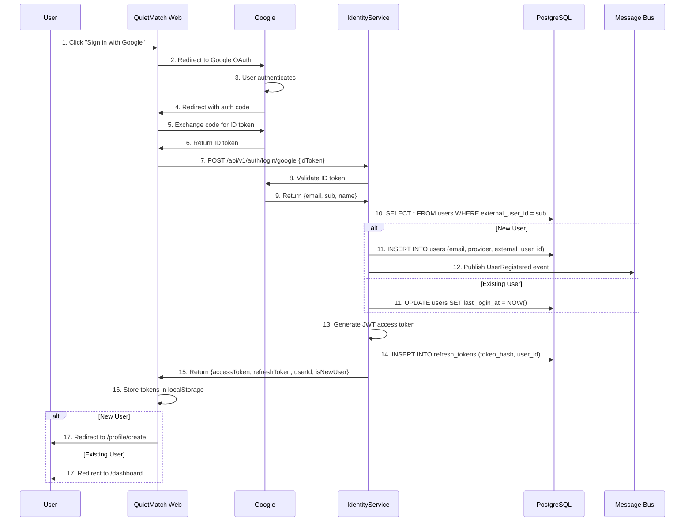

# Feature F0001: Sign In with Google

**Status**: 🔴 Not Started
**Priority**: P0 (Critical - MVP blocker)
**GitHub Issue**: TBD
**Implementation Plan**: [plan.md](./plan.md)
**Assignee**: TBD
**Sprint**: Phase 1 - Foundation
**Estimated Effort**: 8 hours

---

## 🔒 Important

This is the **feature specification** - an **IMMUTABLE INPUT** document. It defines WHAT to build, not HOW.

- ✅ Use this as the authoritative requirements document
- ✅ Reference this during implementation
- ❌ **DO NOT modify this file during implementation**
- 🛑 If requirements change, **STOP and request human approval**

For implementation details and progress tracking, see: **[plan.md](./plan.md)**

---

## Overview

Implement Google Sign-In as the primary authentication method for QuietMatch. Users will authenticate via Google OAuth 2.0, and the IdentityService will issue JWT tokens for API access.

---

## Goals

### Primary Goals
- ✅ Users can sign in using their Google account
- ✅ IdentityService validates Google ID tokens server-side
- ✅ New users are automatically created on first sign-in
- ✅ Returning users are recognized and logged in
- ✅ JWT access token (15 min) and refresh token (7 days) are issued
- ✅ Tokens are stored securely on the client

### Secondary Goals
- ✅ User registration event published for ProfileService
- ✅ Sign-in flow tracked in analytics
- ✅ Error handling for invalid/expired Google tokens

---

## Non-Goals (Out of Scope)

- ❌ Apple Sign-In (separate feature: F0002)
- ❌ Email/password authentication (not supported by design)
- ❌ Multi-factor authentication (future enhancement)
- ❌ Profile creation during sign-in (handled by ProfileService)

---

## Acceptance Criteria

### Functional Requirements

- [ ] **AC1**: User clicks "Sign in with Google" button
- [ ] **AC2**: User redirects to Google consent screen
- [ ] **AC3**: After Google authentication, user redirects back to QuietMatch with authorization code
- [ ] **AC4**: Frontend exchanges code for Google ID token
- [ ] **AC5**: Frontend sends ID token to `/api/v1/auth/login/google`
- [ ] **AC6**: IdentityService validates ID token with Google API
- [ ] **AC7**: If new user, IdentityService creates user record
- [ ] **AC8**: If existing user, IdentityService updates `lastLoginAt`
- [ ] **AC9**: IdentityService generates JWT access token (15 min expiry)
- [ ] **AC10**: IdentityService creates refresh token (7 days expiry, hashed in DB)
- [ ] **AC11**: Response includes `{accessToken, refreshToken, userId, isNewUser}`
- [ ] **AC12**: Frontend stores tokens securely (localStorage for web, SecureStorage for mobile)
- [ ] **AC13**: If new user (`isNewUser: true`), redirect to profile creation
- [ ] **AC14**: If existing user, redirect to dashboard/home

### Non-Functional Requirements

- [ ] **NF1**: ID token validation completes in <500ms (p95)
- [ ] **NF2**: Entire sign-in flow completes in <3 seconds (p95)
- [ ] **NF3**: Rate limiting: Max 5 login attempts per IP per minute
- [ ] **NF4**: All errors logged with correlation IDs
- [ ] **NF5**: Google API failures degrade gracefully (retry with exponential backoff)

### Security Requirements

- [ ] **SEC1**: ID token validated server-side (never trust client)
- [ ] **SEC2**: Verify `aud` (audience) claim matches our Google Client ID
- [ ] **SEC3**: Verify `iss` (issuer) is `https://accounts.google.com`
- [ ] **SEC4**: Verify `exp` (expiry) to prevent replay attacks
- [ ] **SEC5**: Refresh token hashed (SHA-256) before storage
- [ ] **SEC6**: Access token includes `jti` (unique ID) to prevent replay
- [ ] **SEC7**: HTTPS required for all endpoints (no HTTP in production)

---

## User Stories

### Story 1: New User Sign-In

**As a** visitor
**I want to** sign in with my Google account
**So that** I can create a QuietMatch profile without creating a new password

**Scenario**: First-time Google sign-in
```gherkin
Given I am on the QuietMatch landing page
And I have never signed in before
When I click "Sign in with Google"
And I authorize QuietMatch in Google's consent screen
Then I am redirected back to QuietMatch
And a new user account is created
And I receive an access token and refresh token
And I am redirected to the profile creation page
And I see a welcome message
```

### Story 2: Returning User Sign-In

**As a** returning member
**I want to** quickly sign in with Google
**So that** I can access my profile and matches

**Scenario**: Returning user sign-in
```gherkin
Given I have previously signed in with Google
When I click "Sign in with Google"
And I am already logged into Google in my browser
Then I am automatically signed in to QuietMatch
And my lastLoginAt timestamp is updated
And I receive new access and refresh tokens
And I am redirected to the dashboard
```

---

## API Specification

### Endpoint: Sign In with Google

**Method**: `POST /api/v1/auth/login/google`

**Request**:
```json
{
  "idToken": "eyJhbGciOiJSUzI1NiIsImtpZCI6IjFkYzBmMTc..."
}
```

**Response** (200 OK - New User):
```json
{
  "accessToken": "eyJhbGciOiJIUzI1NiIsInR5cCI6IkpXVCJ9...",
  "refreshToken": "550e8400-e29b-41d4-a716-446655440000",
  "expiresIn": 900,
  "tokenType": "Bearer",
  "userId": "3fa85f64-5717-4562-b3fc-2c963f66afa6",
  "isNewUser": true,
  "email": "user@example.com"
}
```

**Response** (200 OK - Existing User):
```json
{
  "accessToken": "eyJhbGciOiJIUzI1NiIsInR5cCI6IkpXVCJ9...",
  "refreshToken": "550e8400-e29b-41d4-a716-446655440000",
  "expiresIn": 900,
  "tokenType": "Bearer",
  "userId": "3fa85f64-5717-4562-b3fc-2c963f66afa6",
  "isNewUser": false,
  "email": "user@example.com"
}
```

**Error Responses**:

```json
// 400 Bad Request - Invalid ID token
{
  "type": "https://tools.ietf.org/html/rfc7231#section-6.5.1",
  "title": "Invalid ID Token",
  "status": 400,
  "detail": "The provided ID token is invalid or expired.",
  "traceId": "0HMVFE42E3F9T:00000001"
}

// 429 Too Many Requests - Rate limit exceeded
{
  "type": "https://tools.ietf.org/html/rfc6585#section-4",
  "title": "Rate Limit Exceeded",
  "status": 429,
  "detail": "Too many login attempts. Please try again in 1 minute.",
  "retryAfter": 60
}

// 500 Internal Server Error - Google API failure
{
  "type": "https://tools.ietf.org/html/rfc7231#section-6.6.1",
  "title": "Authentication Service Unavailable",
  "status": 500,
  "detail": "Unable to validate your Google account. Please try again later."
}
```

---

## Sequence Diagram



---

## Database Changes

### New Tables

#### `users`
```sql
CREATE TABLE users (
    id UUID PRIMARY KEY DEFAULT gen_random_uuid(),
    email VARCHAR(255) NOT NULL,
    provider VARCHAR(50) NOT NULL CHECK (provider IN ('Google', 'Apple')),
    external_user_id VARCHAR(255) NOT NULL,
    created_at TIMESTAMP NOT NULL DEFAULT NOW(),
    last_login_at TIMESTAMP,
    CONSTRAINT unique_provider_user UNIQUE (provider, external_user_id)
);

CREATE INDEX idx_users_email ON users(email);
CREATE INDEX idx_users_external_user_id ON users(provider, external_user_id);
```

#### `refresh_tokens`
```sql
CREATE TABLE refresh_tokens (
    id UUID PRIMARY KEY DEFAULT gen_random_uuid(),
    user_id UUID NOT NULL REFERENCES users(id) ON DELETE CASCADE,
    token_hash VARCHAR(255) NOT NULL,
    expires_at TIMESTAMP NOT NULL,
    created_at TIMESTAMP NOT NULL DEFAULT NOW(),
    revoked_at TIMESTAMP NULL,
    is_revoked BOOLEAN NOT NULL DEFAULT FALSE,
    CONSTRAINT unique_token_hash UNIQUE (token_hash)
);

CREATE INDEX idx_refresh_tokens_user_id ON refresh_tokens(user_id);
CREATE INDEX idx_refresh_tokens_expires_at ON refresh_tokens(expires_at);
```

---

## Events Published

### UserRegistered

**When**: New user signs in for the first time

**Payload**:
```json
{
  "userId": "3fa85f64-5717-4562-b3fc-2c963f66afa6",
  "email": "user@example.com",
  "provider": "Google",
  "registeredAt": "2025-11-20T10:30:00Z",
  "correlationId": "abc123"
}
```

**Subscribers**:
- **ProfileService**: Creates empty profile
- **NotificationService**: Sends welcome email
- **AnalyticsService**: Tracks new user registration

---

## Configuration

### Environment Variables

```bash
# Google OAuth
GOOGLE_CLIENT_ID=your-client-id.apps.googleusercontent.com
GOOGLE_CLIENT_SECRET=your-client-secret

# JWT
JWT_SECRET_KEY=your-256-bit-secret-key-base64
JWT_ISSUER=https://quietmatch.com
JWT_AUDIENCE=https://api.quietmatch.com
JWT_ACCESS_TOKEN_EXPIRY_MINUTES=15
JWT_REFRESH_TOKEN_EXPIRY_DAYS=7
```

### Google OAuth Setup

1. Go to [Google Cloud Console](https://console.cloud.google.com/apis/credentials)
2. Create OAuth 2.0 Client ID
3. Add authorized redirect URIs:
   - Local: `http://localhost:3000/auth/callback`
   - Production: `https://quietmatch.com/auth/callback`
4. Copy Client ID and Client Secret to `.env`

---

## Testing Strategy

### Unit Tests

```csharp
// IdentityService.Tests/Unit/Application/AuthServiceTests.cs

[Fact]
public async Task LoginWithGoogle_WhenTokenValid_ShouldReturnAccessToken()
{
    // Arrange
    var mockGoogleService = new Mock<IGoogleAuthService>();
    mockGoogleService.Setup(s => s.ValidateIdTokenAsync(It.IsAny<string>()))
        .ReturnsAsync(new GoogleUserInfo { Sub = "google-123", Email = "test@example.com" });

    var service = new AuthService(mockGoogleService.Object, ...);

    // Act
    var result = await service.LoginWithGoogleAsync("valid-id-token");

    // Assert
    Assert.NotNull(result.AccessToken);
    Assert.NotNull(result.RefreshToken);
}

[Fact]
public async Task LoginWithGoogle_WhenTokenInvalid_ShouldThrowException()
{
    // Arrange
    var mockGoogleService = new Mock<IGoogleAuthService>();
    mockGoogleService.Setup(s => s.ValidateIdTokenAsync(It.IsAny<string>()))
        .ThrowsAsync(new GoogleAuthException("Invalid token"));

    var service = new AuthService(mockGoogleService.Object, ...);

    // Act & Assert
    await Assert.ThrowsAsync<GoogleAuthException>(() =>
        service.LoginWithGoogleAsync("invalid-token"));
}
```

### Integration Tests

```csharp
// IdentityService.Tests/Integration/AuthControllerTests.cs

[Fact]
public async Task GoogleLogin_WhenNewUser_ShouldCreateUserAndReturnTokens()
{
    // Arrange
    var client = _factory.CreateClient();
    var mockIdToken = CreateMockGoogleIdToken(); // Helper method

    // Act
    var response = await client.PostAsJsonAsync("/api/v1/auth/login/google",
        new { idToken = mockIdToken });

    // Assert
    response.EnsureSuccessStatusCode();
    var result = await response.Content.ReadFromJsonAsync<LoginResponse>();

    Assert.True(result.IsNewUser);
    Assert.NotNull(result.AccessToken);

    // Verify user in database
    var user = await _dbContext.Users.FirstAsync(u => u.Email == "test@example.com");
    Assert.NotNull(user);
}
```

### Manual Testing Checklist

- [ ] Sign in with new Google account works
- [ ] Sign in with existing Google account works
- [ ] Invalid ID token returns 400 error
- [ ] Expired ID token returns 400 error
- [ ] Rate limiting blocks after 5 attempts
- [ ] UserRegistered event published for new users
- [ ] Tokens stored correctly in browser
- [ ] Redirect to profile creation for new users
- [ ] Redirect to dashboard for existing users

---

## Implementation Checklist

### Backend (IdentityService)

- [ ] Create `User` entity (Domain)
- [ ] Create `RefreshToken` entity (Domain)
- [ ] Create `IUserRepository` interface (Domain)
- [ ] Implement `UserRepository` (Infrastructure)
- [ ] Create EF Core migrations
- [ ] Create `GoogleAuthService` (Infrastructure)
- [ ] Create `JwtTokenGenerator` (Infrastructure)
- [ ] Create `AuthService` (Application)
- [ ] Create `AuthController` (API)
- [ ] Add rate limiting middleware
- [ ] Add error handling middleware
- [ ] Configure MassTransit for events
- [ ] Write unit tests
- [ ] Write integration tests

### Frontend (TBD - Future Sprint)

- [ ] Add "Sign in with Google" button
- [ ] Implement Google OAuth client flow
- [ ] Call `/api/v1/auth/login/google`
- [ ] Store tokens in localStorage/SecureStorage
- [ ] Redirect based on `isNewUser` flag
- [ ] Handle error states (invalid token, rate limit)

---

## Dependencies

### Upstream Dependencies (Blockers)
- Docker Compose infrastructure running (PostgreSQL, RabbitMQ)
- Google OAuth Client ID and Secret configured

### Downstream Dependencies (Depends on this feature)
- **F0002**: Profile Creation (needs `UserRegistered` event)
- **F0003**: Token Refresh (needs refresh token implementation)

---

## Risks & Mitigations

| Risk | Impact | Probability | Mitigation |
|------|--------|-------------|------------|
| Google API downtime | High (users can't sign in) | Low | Implement retry logic, show user-friendly error |
| ID token validation slow | Medium (poor UX) | Medium | Cache Google public keys, implement timeout |
| Refresh token theft | High (account takeover) | Low | Hash tokens, implement token rotation, monitor for anomalies |
| Rate limiting too strict | Medium (legitimate users blocked) | Medium | Monitor metrics, adjust limits, implement CAPTCHA for edge cases |

---

## Rollout Plan

### Phase 1: Development
- Implement backend (IdentityService)
- Write tests
- Test with Postman/cURL

### Phase 2: Staging
- Deploy to staging environment
- Test with real Google OAuth (sandbox)
- Load testing (100 concurrent logins)

### Phase 3: Production
- Deploy to production
- Monitor error rates, latency
- Gradual rollout (10% → 50% → 100%)
- Rollback plan: Revert to previous version via blue-green deployment

---

## Monitoring & Metrics

### Key Metrics
- **Sign-in success rate**: Target 99%
- **Sign-in latency (p95)**: Target <3 seconds
- **Google API error rate**: Target <1%
- **Rate limit triggers**: Monitor for anomalies

### Alerts
- Alert if sign-in success rate <95%
- Alert if p95 latency >5 seconds
- Alert if Google API errors >5%

### Dashboards
- Real-time sign-in count
- Error breakdown (400, 500, Google API)
- Token refresh rate

---

## Documentation Updates

- [ ] Update `.env.example` with Google OAuth variables
- [ ] Update `docs/30_microservices/identity-service.md` with endpoint details
- [ ] Update `README.md` with sign-in flow overview
- [ ] Create ADR for choosing custom IdentityService over Duende

---

## References

- [Architecture Guidelines](../10_architecture/02_architecture-guidelines.md)
- [Security & Auth](../10_architecture/05_security-and-auth.md)
- [IdentityService Documentation](../30_microservices/identity-service.md)
- [Ubiquitous Language](../20_domain/01_domain-ubiquitous-language.md)
- [Google Sign-In Documentation](https://developers.google.com/identity/sign-in/web)
- [OAuth 2.0 RFC 6749](https://tools.ietf.org/html/rfc6749)

---

**Created**: 2025-11-20
**Last Updated**: 2025-11-20
**Next Review**: After implementation

---

**Notes**:
- This is a template feature file - all future features should follow this format
- Checkboxes track implementation progress
- Update status at top as work progresses
