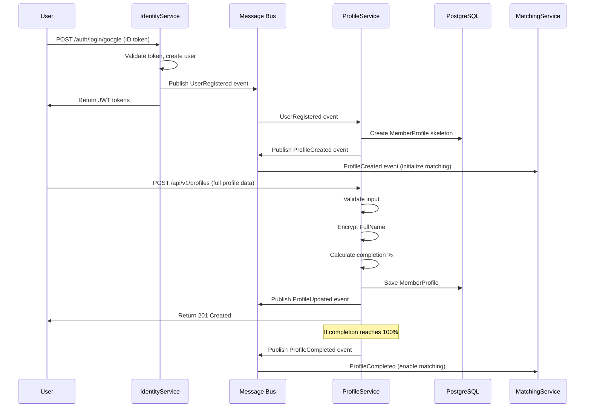

# Feature F0002: ProfileService MVP

**Status**: 🔴 Not Started
**Priority**: P0 (Critical - MVP blocker)
**GitHub Issue**: TBD
**Implementation Plan**: [plan.md](./plan.md)
**Assignee**: TBD
**Sprint**: Phase 2 - Core Services
**Estimated Effort**: 16-24 hours

---

## 🔒 Important

This is the **feature specification** - an **IMMUTABLE INPUT** document. It defines WHAT to build, not HOW.

- ✅ Use this as the authoritative requirements document
- ✅ Reference this during implementation
- ❌ **DO NOT modify this file during implementation**
- 🛑 If requirements change, **STOP and request human approval**

For implementation details and progress tracking, see: **[plan.md](./plan.md)**

---

## Overview

Implement ProfileService as the core microservice for managing member profiles, personality data, values, preferences, and privacy settings. ProfileService uses **Onion Architecture** to encapsulate rich domain logic around privacy rules, validation, and GDPR compliance.

---

## Goals

### Primary Goals
- ✅ Consume `UserRegistered` event from IdentityService and auto-create profile skeleton
- ✅ Members can create and update their personality profile (Big Five traits)
- ✅ Members can define their values (family, career, spirituality, etc.)
- ✅ Members can set lifestyle preferences
- ✅ Members can configure matching preferences (age range, distance, gender)
- ✅ Members can control privacy via Exposure Levels
- ✅ Sensitive profile data encrypted at rest (field-level encryption)
- ✅ Full CRUD API for profiles with JWT authentication

### Secondary Goals
- ✅ Publish domain events (`ProfileCreated`, `ProfileUpdated`, `ProfileCompleted`)
- ✅ Track profile completion percentage
- ✅ Validate all inputs with business rules
- ✅ Support partial updates (PATCH semantics)

### Non-Goals (Out of Scope for MVP)
- ❌ Photo uploads (future feature)
- ❌ Profile search/discovery (MatchingService responsibility)
- ❌ AI-powered personality insights (future enhancement)
- ❌ Social media integrations beyond basic OAuth
- ❌ Profile verification (VerificationService responsibility)

---

## Acceptance Criteria

### Functional Requirements - Event Consumption

- [ ] **AC1**: ProfileService consumes `UserRegistered` event from IdentityService
- [ ] **AC2**: On `UserRegistered`, create `MemberProfile` entity with skeleton data (UserId, Email, CreatedAt)
- [ ] **AC3**: Initial profile marked as incomplete (`IsComplete: false`, `CompletionPercentage: 0`)
- [ ] **AC4**: Publish `ProfileCreated` event after profile skeleton created

### Functional Requirements - Profile CRUD

- [ ] **AC5**: `POST /api/v1/profiles` creates a member profile
- [ ] **AC6**: `GET /api/v1/profiles/{userId}` retrieves member's own profile
- [ ] **AC7**: `PATCH /api/v1/profiles/{userId}` updates profile fields (partial updates supported)
- [ ] **AC8**: `DELETE /api/v1/profiles/{userId}` soft-deletes profile (GDPR compliance)
- [ ] **AC9**: Only the authenticated user can access/modify their own profile (authorization)
- [ ] **AC10**: Profile includes: FullName (encrypted), DateOfBirth, Gender, Location (City, Country)

### Functional Requirements - Personality Profile

- [ ] **AC11**: Member can set Big Five personality traits (Openness, Conscientiousness, Extraversion, Agreeableness, Neuroticism) on 1-5 scale
- [ ] **AC12**: Member can add free-text fields: `AboutMe` (500 char max), `LifePhilosophy` (500 char max)
- [ ] **AC13**: Personality data stored as value object `PersonalityProfile`
- [ ] **AC14**: Validation ensures trait scores are 1-5 inclusive

### Functional Requirements - Values

- [ ] **AC15**: Member can rate values on 1-5 scale: FamilyOrientation, CareerAmbition, Spirituality, Adventure, IntellectualCuriosity, SocialJustice, FinancialSecurity, Environmentalism
- [ ] **AC16**: Values stored as value object `Values`
- [ ] **AC17**: Validation ensures all value scores are 1-5 inclusive

### Functional Requirements - Lifestyle

- [ ] **AC18**: Member can set lifestyle attributes: ExerciseFrequency, DietType, SmokingStatus, DrinkingFrequency, HasPets, WantsChildren
- [ ] **AC19**: Lifestyle stored as value object `Lifestyle`
- [ ] **AC20**: Enums used for predefined choices (e.g., `SmokingStatus`: Never, Occasionally, Regularly)

### Functional Requirements - Preferences

- [ ] **AC21**: Member can set matching preferences: PreferredAgeRange (min/max), MaxDistanceKm, PreferredLanguages (list), GenderPreference (enum)
- [ ] **AC22**: Preferences stored as value object `PreferenceSet`
- [ ] **AC23**: Validation ensures `AgeMin >= 18`, `AgeMax <= 100`, `AgeMin <= AgeMax`
- [ ] **AC24**: Validation ensures `MaxDistanceKm` between 1-500 km

### Functional Requirements - Privacy

- [ ] **AC25**: Member can set `ExposureLevel`: `MatchedOnly` (highest privacy), `AllMatches` (moderate), `Public` (lowest - future)
- [ ] **AC26**: Default exposure level is `MatchedOnly`
- [ ] **AC27**: Domain logic enforces: FullName only visible per exposure rules
- [ ] **AC28**: Privacy rules implemented as domain methods (e.g., `CanShareWith(otherMemberId, matchStatus)`)

### Functional Requirements - Completion Tracking

- [ ] **AC29**: Calculate `CompletionPercentage` based on filled fields (0-100%)
- [ ] **AC30**: Mark profile as `IsComplete: true` when all required fields filled and percentage >= 80%
- [ ] **AC31**: Publish `ProfileCompleted` event when profile first becomes complete

### Non-Functional Requirements

- [ ] **NF1**: API responses in <200ms for GET (p95)
- [ ] **NF2**: API responses in <500ms for POST/PATCH (p95)
- [ ] **NF3**: Support 1000 concurrent users
- [ ] **NF4**: All database queries use indexes (no full table scans)
- [ ] **NF5**: Structured logging with correlation IDs
- [ ] **NF6**: Health checks for database and message bus

### Security Requirements

- [ ] **SEC1**: All endpoints require valid JWT access token
- [ ] **SEC2**: `FullName` field encrypted at rest using AES-256 (via EF Core value converter)
- [ ] **SEC3**: User can only access/modify their own profile (UserId from JWT claims)
- [ ] **SEC4**: Soft delete sets `DeletedAt` timestamp, does NOT remove data immediately
- [ ] **SEC5**: Input validation on all fields (FluentValidation)
- [ ] **SEC6**: HTTPS enforced on all endpoints
- [ ] **SEC7**: CORS policy configured for authorized origins only

### GDPR Requirements

- [ ] **GDPR1**: Right to access: User can retrieve their full profile via API
- [ ] **GDPR2**: Right to rectification: User can update any profile field
- [ ] **GDPR3**: Right to erasure: Soft delete with 30-day retention, then hard delete
- [ ] **GDPR4**: Data minimization: Only collect necessary fields
- [ ] **GDPR5**: Purpose limitation: Profile data only used for matching
- [ ] **GDPR6**: Consent tracked: ExposureLevel represents data sharing consent

---

## User Stories

### Story 1: New User Creates Profile

```gherkin
Given I am a new user who just signed in with Google
And I have received a JWT access token
When I navigate to the profile creation page
And I fill in my basic information (name, DOB, location)
And I complete the personality questionnaire
And I set my values and lifestyle preferences
And I configure my matching preferences
And I submit the profile
Then my profile should be created successfully
And I should see "Profile created successfully"
And my profile completion percentage should be calculated
And a ProfileCreated event should be published
```

### Story 2: Existing User Updates Privacy Settings

```gherkin
Given I am an existing user with a complete profile
And I am authenticated with a valid JWT token
When I navigate to privacy settings
And I change my ExposureLevel from "MatchedOnly" to "AllMatches"
And I save my changes
Then my privacy settings should be updated
And I should see "Privacy settings updated"
And future matches should see my data per new exposure level
```

### Story 3: User Completes Partial Profile

```gherkin
Given I have a partial profile (50% complete)
And I am missing personality traits and values
When I fill in all personality trait scores
And I fill in all values ratings
And I save my profile
Then my CompletionPercentage should increase to 100%
And IsComplete should become true
And a ProfileCompleted event should be published
```

---

## API Specification

### Base URL
```
http://localhost:5001/api/v1/profiles
```

### Authentication
All endpoints require JWT Bearer token:
```
Authorization: Bearer <access-token>
```

---

### 1. Create Profile

**Endpoint**: `POST /api/v1/profiles`

**Request Body**:
```json
{
  "fullName": "Jane Doe",
  "dateOfBirth": "1990-05-15",
  "gender": "Female",
  "location": {
    "city": "Berlin",
    "country": "Germany",
    "latitude": 52.5200,
    "longitude": 13.4050
  },
  "personality": {
    "openness": 4,
    "conscientiousness": 5,
    "extraversion": 3,
    "agreeableness": 4,
    "neuroticism": 2,
    "aboutMe": "I love hiking, reading philosophy, and exploring new cultures.",
    "lifePhilosophy": "Live simply, think deeply, care greatly."
  },
  "values": {
    "familyOrientation": 5,
    "careerAmbition": 4,
    "spirituality": 3,
    "adventure": 5,
    "intellectualCuriosity": 5,
    "socialJustice": 4,
    "financialSecurity": 3,
    "environmentalism": 5
  },
  "lifestyle": {
    "exerciseFrequency": "Regularly",
    "dietType": "Vegetarian",
    "smokingStatus": "Never",
    "drinkingFrequency": "Occasionally",
    "hasPets": true,
    "wantsChildren": "Yes"
  },
  "preferences": {
    "preferredAgeRange": {
      "min": 28,
      "max": 38
    },
    "maxDistanceKm": 50,
    "preferredLanguages": ["English", "German"],
    "genderPreference": "Men"
  },
  "exposureLevel": "MatchedOnly"
}
```

**Response (201 Created)**:
```json
{
  "userId": "3fa85f64-5717-4562-b3fc-2c963f66afa6",
  "fullName": "Jane Doe",
  "dateOfBirth": "1990-05-15",
  "gender": "Female",
  "location": {
    "city": "Berlin",
    "country": "Germany"
  },
  "personality": { ... },
  "values": { ... },
  "lifestyle": { ... },
  "preferences": { ... },
  "exposureLevel": "MatchedOnly",
  "completionPercentage": 100,
  "isComplete": true,
  "createdAt": "2025-11-26T10:00:00Z",
  "updatedAt": "2025-11-26T10:00:00Z"
}
```

**Error Responses**:
- `400 Bad Request`: Validation errors (missing required fields, invalid values)
- `401 Unauthorized`: Missing or invalid JWT token
- `409 Conflict`: Profile already exists for this user

---

### 2. Get Profile

**Endpoint**: `GET /api/v1/profiles/{userId}`

**Response (200 OK)**:
```json
{
  "userId": "3fa85f64-5717-4562-b3fc-2c963f66afa6",
  "fullName": "Jane Doe",
  "completionPercentage": 100,
  "isComplete": true,
  ...
}
```

**Error Responses**:
- `401 Unauthorized`: Missing or invalid JWT token
- `403 Forbidden`: User can only access their own profile
- `404 Not Found`: Profile does not exist

---

### 3. Update Profile (Partial)

**Endpoint**: `PATCH /api/v1/profiles/{userId}`

**Request Body** (example - partial update):
```json
{
  "personality": {
    "aboutMe": "Updated bio with new hobbies."
  },
  "exposureLevel": "AllMatches"
}
```

**Response (200 OK)**:
```json
{
  "userId": "3fa85f64-5717-4562-b3fc-2c963f66afa6",
  "fullName": "Jane Doe",
  "personality": {
    "aboutMe": "Updated bio with new hobbies.",
    ...
  },
  "exposureLevel": "AllMatches",
  "updatedAt": "2025-11-26T11:00:00Z"
}
```

**Error Responses**:
- `400 Bad Request`: Validation errors
- `401 Unauthorized`: Missing or invalid JWT token
- `403 Forbidden`: User can only modify their own profile
- `404 Not Found`: Profile does not exist

---

### 4. Delete Profile (Soft Delete)

**Endpoint**: `DELETE /api/v1/profiles/{userId}`

**Response (204 No Content)**

**Error Responses**:
- `401 Unauthorized`: Missing or invalid JWT token
- `403 Forbidden`: User can only delete their own profile
- `404 Not Found`: Profile does not exist

---

## Database Schema

### MemberProfiles Table

```sql
CREATE TABLE member_profiles (
    user_id UUID PRIMARY KEY,
    full_name_encrypted TEXT NOT NULL, -- AES-256 encrypted
    date_of_birth DATE NOT NULL,
    gender VARCHAR(50) NOT NULL,

    -- Location (embedded)
    location_city VARCHAR(100),
    location_country VARCHAR(100),
    location_latitude DECIMAL(9, 6),
    location_longitude DECIMAL(9, 6),

    -- Personality (JSON stored as JSONB for querying)
    personality_openness INT CHECK (personality_openness BETWEEN 1 AND 5),
    personality_conscientiousness INT CHECK (personality_conscientiousness BETWEEN 1 AND 5),
    personality_extraversion INT CHECK (personality_extraversion BETWEEN 1 AND 5),
    personality_agreeableness INT CHECK (personality_agreeableness BETWEEN 1 AND 5),
    personality_neuroticism INT CHECK (personality_neuroticism BETWEEN 1 AND 5),
    personality_about_me TEXT,
    personality_life_philosophy TEXT,

    -- Values
    values_family_orientation INT CHECK (values_family_orientation BETWEEN 1 AND 5),
    values_career_ambition INT CHECK (values_career_ambition BETWEEN 1 AND 5),
    values_spirituality INT CHECK (values_spirituality BETWEEN 1 AND 5),
    values_adventure INT CHECK (values_adventure BETWEEN 1 AND 5),
    values_intellectual_curiosity INT CHECK (values_intellectual_curiosity BETWEEN 1 AND 5),
    values_social_justice INT CHECK (values_social_justice BETWEEN 1 AND 5),
    values_financial_security INT CHECK (values_financial_security BETWEEN 1 AND 5),
    values_environmentalism INT CHECK (values_environmentalism BETWEEN 1 AND 5),

    -- Lifestyle
    lifestyle_exercise_frequency VARCHAR(50),
    lifestyle_diet_type VARCHAR(50),
    lifestyle_smoking_status VARCHAR(50),
    lifestyle_drinking_frequency VARCHAR(50),
    lifestyle_has_pets BOOLEAN,
    lifestyle_wants_children VARCHAR(50),

    -- Preferences
    preferences_age_min INT CHECK (preferences_age_min >= 18),
    preferences_age_max INT CHECK (preferences_age_max <= 100),
    preferences_max_distance_km INT CHECK (preferences_max_distance_km BETWEEN 1 AND 500),
    preferences_languages JSONB, -- Array of language codes
    preferences_gender_preference VARCHAR(50),

    -- Privacy
    exposure_level VARCHAR(50) NOT NULL DEFAULT 'MatchedOnly',

    -- Metadata
    completion_percentage INT CHECK (completion_percentage BETWEEN 0 AND 100) DEFAULT 0,
    is_complete BOOLEAN DEFAULT FALSE,

    created_at TIMESTAMPTZ NOT NULL DEFAULT NOW(),
    updated_at TIMESTAMPTZ NOT NULL DEFAULT NOW(),
    deleted_at TIMESTAMPTZ NULL,

    -- Indexes
    CONSTRAINT check_age_range CHECK (preferences_age_min <= preferences_age_max)
);

CREATE INDEX idx_member_profiles_deleted_at ON member_profiles(deleted_at) WHERE deleted_at IS NULL;
CREATE INDEX idx_member_profiles_is_complete ON member_profiles(is_complete);
```

---

## Events Published

### 1. ProfileCreated

**When**: After a new profile skeleton is created from UserRegistered event

**Payload**:
```json
{
  "userId": "3fa85f64-5717-4562-b3fc-2c963f66afa6",
  "email": "jane.doe@example.com",
  "createdAt": "2025-11-26T10:00:00Z",
  "correlationId": "abc123-def456"
}
```

**Subscribers**: MatchingService (to initialize match candidates)

---

### 2. ProfileUpdated

**When**: After any profile field is updated

**Payload**:
```json
{
  "userId": "3fa85f64-5717-4562-b3fc-2c963f66afa6",
  "updatedFields": ["personality.aboutMe", "exposureLevel"],
  "updatedAt": "2025-11-26T11:00:00Z",
  "correlationId": "abc123-def456"
}
```

**Subscribers**: MatchingService (to re-evaluate match compatibility)

---

### 3. ProfileCompleted

**When**: Profile completion percentage reaches 100% for the first time

**Payload**:
```json
{
  "userId": "3fa85f64-5717-4562-b3fc-2c963f66afa6",
  "completedAt": "2025-11-26T10:30:00Z",
  "correlationId": "abc123-def456"
}
```

**Subscribers**: MatchingService (to enable matching), NotificationService (to send "Profile complete!" notification)

---

## Events Consumed

### UserRegistered (from IdentityService)

**Payload**:
```json
{
  "userId": "3fa85f64-5717-4562-b3fc-2c963f66afa6",
  "email": "jane.doe@example.com",
  "provider": "Google",
  "registeredAt": "2025-11-26T09:00:00Z",
  "correlationId": "abc123-def456"
}
```

**Action**: Create MemberProfile skeleton with `userId` and `email`, set `IsComplete: false`, `CompletionPercentage: 0`

---

## Sequence Diagram



---

## Configuration

### Environment Variables

```bash
# Database
PROFILE_DB_CONNECTION_STRING=Host=localhost;Port=5432;Database=profile_db;Username=admin;Password=***

# Messaging
RABBITMQ_HOST=localhost
RABBITMQ_USERNAME=guest
RABBITMQ_PASSWORD=guest
AZURE_SERVICE_BUS_CONNECTION_STRING=Endpoint=sb://...  # Production only

# Security
JWT_SECRET_KEY=*** (256-bit key)
JWT_ISSUER=https://quietmatch.com
JWT_AUDIENCE=https://api.quietmatch.com
ENCRYPTION_KEY=*** (256-bit AES key for field-level encryption)

# API
API_PORT=5001
ASPNETCORE_ENVIRONMENT=Development

# Logging
SEQ_URL=http://localhost:5341
APPLICATION_INSIGHTS_KEY=*** # Azure only
```

---

## Testing Strategy

### Unit Tests (Domain Layer)

- [ ] Test `MemberProfile.Create()` factory method
- [ ] Test `MemberProfile.UpdatePersonality()` method
- [ ] Test `MemberProfile.CalculateCompletion()` calculates percentage correctly
- [ ] Test `MemberProfile.CanShareWith(otherMemberId, matchStatus)` privacy rules
- [ ] Test `PersonalityProfile` validation (scores 1-5)
- [ ] Test `Values` validation (scores 1-5)
- [ ] Test `PreferenceSet` validation (age range, distance)
- [ ] Test `ExposureLevel` enum values

### Integration Tests (Infrastructure Layer)

- [ ] Test `ProfileRepository.AddAsync()` persists to database
- [ ] Test `ProfileRepository.GetByIdAsync()` retrieves from database
- [ ] Test `ProfileRepository.UpdateAsync()` updates database
- [ ] Test field-level encryption (FullName encrypted/decrypted correctly)
- [ ] Test `UserRegisteredConsumer` handles event and creates profile
- [ ] Test domain events published to message bus

### API Tests (WebApplicationFactory)

- [ ] Test `POST /api/v1/profiles` with valid data returns 201
- [ ] Test `POST /api/v1/profiles` with invalid data returns 400
- [ ] Test `POST /api/v1/profiles` without JWT returns 401
- [ ] Test `GET /api/v1/profiles/{userId}` returns user's profile (200)
- [ ] Test `GET /api/v1/profiles/{userId}` for other user returns 403
- [ ] Test `PATCH /api/v1/profiles/{userId}` updates profile (200)
- [ ] Test `DELETE /api/v1/profiles/{userId}` soft-deletes profile (204)
- [ ] Test all tests use Testcontainers for real PostgreSQL

### Manual Testing

- [ ] Use Postman/Insomnia to test full CRUD flow
- [ ] Verify FullName encrypted in database (inspect via psql)
- [ ] Verify `UserRegistered` event triggers profile creation
- [ ] Verify `ProfileCompleted` event published when reaching 100%
- [ ] Check RabbitMQ management UI for events
- [ ] Check Seq logs for correlation IDs

---

## Implementation Checklist

See [plan.md](./plan.md) for detailed implementation roadmap.

High-level phases:
- [ ] Phase 0: Setup (project structure, dependencies)
- [ ] Phase 1: Domain Layer (entities, value objects, events)
- [ ] Phase 2: Application Layer (use cases, DTOs, services)
- [ ] Phase 3: Infrastructure Layer (EF Core, repositories, encryption, messaging)
- [ ] Phase 4: API Layer (controllers, Program.cs, DI, JWT)
- [ ] Phase 5: Testing (unit, integration, API tests)
- [ ] Phase 6: Docker Integration (Dockerfile, docker-compose)
- [ ] Phase 7: Documentation (PATTERNS.md, README.md)

---

## Dependencies

### Upstream Dependencies (Must Complete First)
- ✅ F0001: Sign In with Google (IdentityService must publish `UserRegistered` event)
- ✅ Docker infrastructure (PostgreSQL, RabbitMQ)

### Downstream Dependencies (Will Depend on This)
- 🔜 MatchingService: Needs ProfileCompleted event to start matching
- 🔜 NotificationService: Needs ProfileCompleted event to send notifications

---

## Risks & Mitigations

| Risk | Impact | Mitigation |
|------|--------|-----------|
| **Encryption key compromise** | High - PII exposure | Store keys in Azure Key Vault (production), use key rotation strategy |
| **Message bus failure** | Medium - Events not processed | Implement outbox pattern for guaranteed event delivery |
| **Profile data model changes** | Medium - Breaking changes | Use EF Core migrations with expand/contract pattern |
| **Performance with large datasets** | Low - Queries slow | Use database indexes, implement caching (Redis) for hot profiles |

---

## References

- **Architecture Guidelines**: [`docs/10_architecture/02_architecture-guidelines.md`](../../10_architecture/02_architecture-guidelines.md)
- **Onion Architecture Template**: [`docs/10_architecture/03_service-templates.md`](../../10_architecture/03_service-templates.md) (Section: Onion Architecture)
- **Domain Ubiquitous Language**: [`docs/20_domain/01_domain-ubiquitous-language.md`](../../20_domain/01_domain-ubiquitous-language.md)
- **Security & Auth**: [`docs/10_architecture/05_security-and-auth.md`](../../10_architecture/05_security-and-auth.md)
- **Messaging**: [`docs/10_architecture/06_messaging-and-integration.md`](../../10_architecture/06_messaging-and-integration.md)
- **Feature Workflow**: [`docs/60_operations/feature-workflow.md`](../../60_operations/feature-workflow.md)

---

**Last Updated**: 2025-11-26
**Document Owner**: Engineering Team
**Status**: Specification Complete - Ready for Implementation Planning
